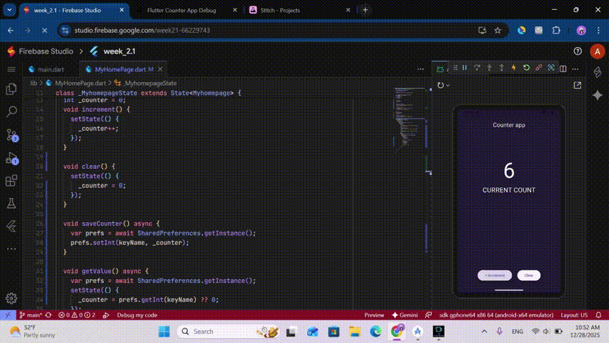

# Flutter Counter App (SharedPreferences)

This repository contains a **Flutter Counter App** that demonstrates persistent local data storage using `SharedPreferences`.  
The application maintains a counter value that is saved locally and restored automatically when the app is reopened.

---

## 📌 Project Overview

The purpose of this minor project is to understand how Flutter applications can store and retrieve simple data locally.  
The app uses `SharedPreferences` to persist the counter value, ensuring data is not lost when the application is closed.

---
## 🖥 Demo

## 🎯 Objectives

- Implement a counter using Flutter
- Store data locally using `SharedPreferences`
- Retrieve stored data during app initialization
- Understand Flutter widget lifecycle (`initState`)
- Practice asynchronous programming in Dart

---

## 🧩 Features

- Increment counter value
- Save counter value locally
- Restore saved value on app restart
- Clear stored counter data
- Simple and clean user interface

---

## 🛠️ Technologies Used

- **Flutter**
- **Dart**
- **SharedPreferences**

---

